# Bazalt

A node-based modular synthesizer. Every sound is a small graph: sources, math,
envelopes and effects wired together on an infinite canvas. You hear every change
while you make it.

Bazalt runs as a standalone app or as a VST3 plugin inside your DAW (Windows x64).

This README is a guided tour in **levels**. Each level builds on the previous one
and introduces a few new ideas. By the end you will play your own synth from a MIDI
keyboard.

---

## Legend

Every port and cable is coloured by **what the signal means**. The symbol next to a
port says the same thing in shape, so you can tell them apart without colour.

| | Kind | Symbol | What it carries |
|---|---|---|---|
|  | **Audio** | → | A sound wave you can hear. |
|  | **Modulation** | → | A movement between 0 and 1 or −1 and 1 (an envelope, a slow wobble). |
|  | **Value** | → | A number with a unit: Hz, seconds, decibels. |
|  | **Integer** | → | A whole number (a count, an index). |
|  | **Trigger** | ! | An instant: "now". A click, a beat, a note start. |
|  | **Gate** | ? | On or off. True while a key is held. |
|  | **Notes** | ♪ | Notes from a keyboard: pitch, velocity, start, stop. |
|  | **Data** | ≡ | A whole shape at once: a curve, a wavetable, a scale. |

**Dot or symbol?** An input with a **dot** (●) has its own value: a slider, a
switch or a menu right next to it. Plug a cable into it and the dot turns into the
symbol, and the cable takes over. Unplug it and the slider comes back. An input
showing only the symbol has no value of its own: it does nothing until a cable arrives.

**Cables:**

| | |
|---|---|
|  | **Mono:** one line. |
|  | **Stereo:** two thin parallel lines, left and right. |
|  | **Poly:** a node playing once per note is drawn as a **stack of cards** with a **×N** badge (N copies). Its cables look normal: poly shows on the node, never on the cable. See [Level 7](#level-7-play-it). |

A red, dashed cable while you drag means the two ports can't be connected.

---

## Contents

- [Legend](#legend)
- [Getting Bazalt](#getting-bazalt)
- [Level 0: Before you start](#level-0-before-you-start)
- [Level 1: Sine](#level-1-sine)
- [Level 2: Too Loud!](#level-2-too-loud)
- [Level 3: It Just Keeps Playing](#level-3-it-just-keeps-playing)
- [Level 4: Faster Hands](#level-4-faster-hands)
- [Level 5: Wobble](#level-5-wobble)
- [Level 6: Draw Your Own Sound](#level-6-draw-your-own-sound)
- [Level 7: Play It](#level-7-play-it)
- [Level 8: Make It Pretty](#level-8-make-it-pretty)
- [Level 9: Keep It](#level-9-keep-it)
- [Cheat sheet](#cheat-sheet)
- [Building from source](#building-from-source)

---

## Getting Bazalt

Download `Bazalt-Standalone-Windows.zip` from the root of this repository and unzip
it somewhere. Inside you will find:

- `Bazalt.exe` with its `ui` folder next to it. Keep them together; the app loads
  its interface from that folder.
- `VST3/Bazalt.vst3`, the plugin. Copy it to `C:\Program Files\Common Files\VST3`
  and rescan plugins in your DAW.

---

## Level 0: Before you start

### Set up your audio and MIDI

**Check the settings first.** The audio output, input and MIDI device are often not
picked correctly on their own, and then you hear nothing.

1. Click **Options** in the top-left corner of the window.
2. Choose **Audio/MIDI Settings...**
3. Set **Output** to your speakers or headphones.
4. Set **Input** to your audio interface. Leave it empty if you don't use audio
   input.
5. Under **Active MIDI inputs**, tick your MIDI keyboard. You'll need it in
   [Level 7](#level-7-play-it).
6. If you hear a howl or feedback, tick **Mute audio input**.

In a DAW you don't need any of this: the DAW decides where the sound goes.

### Find your way around

A new Bazalt opens on an empty canvas with one node: **Master Out**. Whatever you
plug into Master Out is what you hear.

| To | Do this |
|---|---|
| Zoom | Mouse wheel |
| Move around | Right-drag, or hold Space and drag |
| Select | Click a node, or drag a box around several |
| Move nodes | Drag them |
| Delete | Select, then press Delete |
| Undo / redo | Ctrl+Z / Ctrl+Shift+Z |

### Add a node

Press **Shift+A**, or right-click on an empty spot. The node gallery opens.

- Type to search, or browse the categories.
- Pick a node and it sticks to your mouse as a see-through **ghost**.
- **Click** to place it.
- Press **Esc** or right-click to cancel.

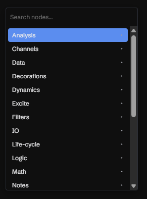
<!-- SCREENSHOT: the Shift+A menu open, browsing the categories -->

---

## Level 1: Sine

**Goal:** hear a tone.

1. Press **Shift+A**, type `sine` and pick **Sine**. Click on the canvas to place it.
2. Find the round port on the right of Sine labelled **Out**. Press on it, drag to
   the **In** port on the left of **Master Out**, and let go.

You should hear a steady 440 Hz tone. The Sine node draws its own waveform, so you
can see what you hear.

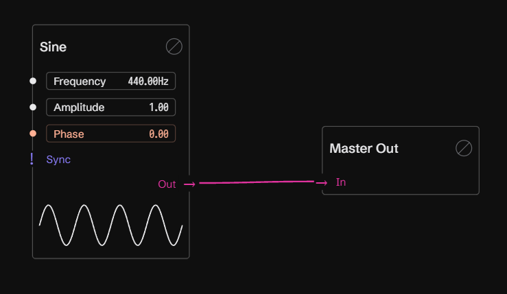
<!-- SCREENSHOT: a Sine node wired into Master Out, the waveform preview visible -->

### Change a value

Every input that isn't wired shows its own value as a slider.

- **Drag** a slider to change the value. Hold **Shift** for fine steps.
- **Click** a slider without moving to type a number. Enter confirms.
- **Double-click** a slider to reset it.

Try dragging **Frequency**. Low values are bass; high values are bright.

### Remove a cable

Press on the **input end** of a cable (where it enters Master Out), pull it away and
let go on an empty spot. The tone stops. Plug it back in.

---

## Level 2: Too Loud!

**Goal:** turn it down.

A Sine at full amplitude is loud. To make a signal quieter, you multiply it by a
number smaller than 1. That's all a "gain" or a "VCA" ever is, so Bazalt has no
special node for it: you use **Multiply**.

1. Press **M**. A Multiply ghost sticks to your mouse. (Shift+A → Multiply works too;
   **M** is just faster.)
2. Move the ghost over the cable between Sine and Master Out. The cable lights up
   and says **click to insert here**.
3. Click. The Multiply is **spliced** into the cable: Sine → Multiply → Master Out.
4. On the Multiply, drag **In 2** down to about `0.1`.

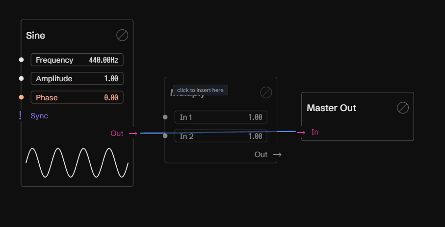
<!-- SCREENSHOT: the Multiply ghost over the Sine→Master Out cable, the cable highlighted with "click to insert here" -->

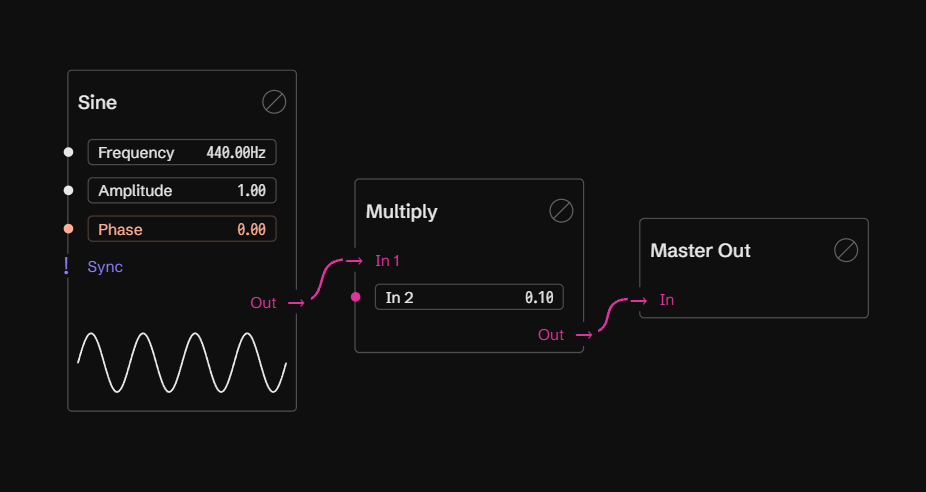
<!-- SCREENSHOT: the finished chain with In 2 at 0.1 -->

> **Splicing** works with any node you are placing: from the gallery, from a letter
> key, or from a duplicate. Drop it on a cable and it goes in between. If the cable
> turns red and dashed, that node can't go there; clicking places it unconnected.

---

## Level 3: It Just Keeps Playing

**Goal:** play a note when you press a button, and only then.

Right now the tone never stops. A real note has a beginning and an end. You'll build
that from three ideas: a **button**, a **gate** and an **envelope**.

### A button

1. Press **Shift+A** and add **Gate Length**. It turns a short **Trigger** into a
   **Gate**: a signal that is *on* for a set **Length**, then *off*.
2. Press on the **Trigger** input on the left of Gate Length and drag it out to an
   empty spot, then let go. Bazalt creates a **Macro** already wired to that input.
   Because Trigger is an event input, the Macro is a **button**.
3. Click the Macro's **Trigger** button.

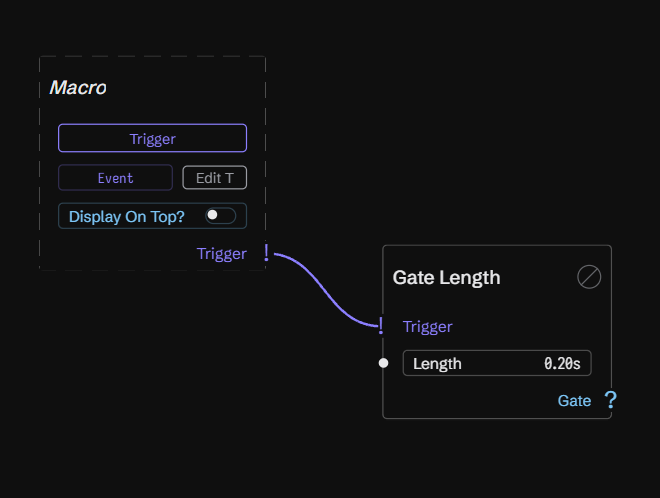
<!-- SCREENSHOT: the Trigger Macro wired to Gate Length -->

> **Dragging an unwired input out to empty space creates a Macro for it.** That works
> on almost any input: a number becomes a slider, an on/off becomes a toggle, a
> trigger becomes a button. Macros are also what your DAW can automate. Each one is
> one of the plugin's 32 parameters, **Macro 1** to **Macro 32**.

### See it

You can't hear a gate, but you can look at it.

- **Ctrl+click** the **Gate** output of Gate Length. A **Scope** appears, already
  wired. It draws the gate over time: **TRUE** while it's on, **FALSE** when it's
  off.
- **Ctrl+click** the **Trigger** output of the Macro. A **Ripple** appears. Every
  click sends out a ring: one ring per trigger.

Click the button a few times and watch both. The trigger is an instant. The gate
lasts as long as **Length** says (0.2 s at first).

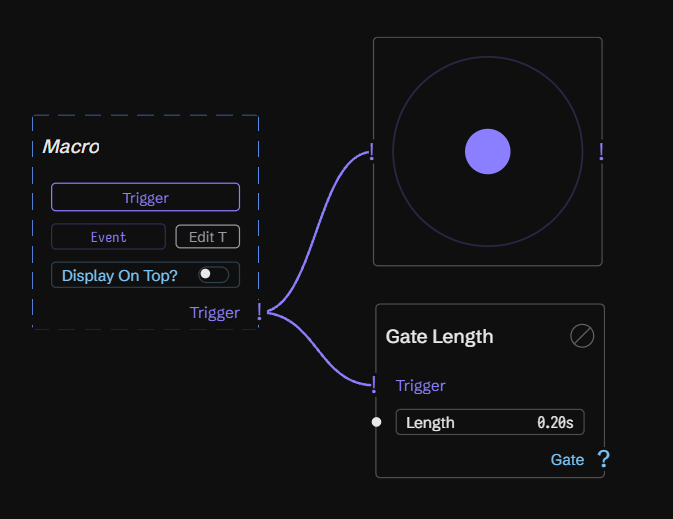
<!-- SCREENSHOT: Ripple on the Macro's Trigger, next to Gate Length -->

> **Ctrl+click any output to look at it.** Bazalt picks the right viewer for you:
> - **Scope** for values and gates
> - **Ripple** for triggers
> - **Count** for whole numbers
> - **Tune** for pitch
>
> To *listen* to an audio output on its own, **Ctrl+Alt+click** it. An ear appears and
> you hear only that point. Ctrl+Alt+click again, or double-click the ear, to stop.

### Shape the note

1. Add an **Envelope** (Shift+A → Envelope).
2. Wire **Gate** from Gate Length into the Envelope's **Gate** input.
3. Splice a second **Multiply** into the cable between Sine and your first
   Multiply: press **M** and click on the cable.
4. Wire the Envelope's **Out** into the new Multiply's **In 2**.

Now press the button. The tone fades in, holds while the gate is on, and fades out.
The Envelope is the volume over time. Ctrl+click its **Out** to see the shape on a
Scope.

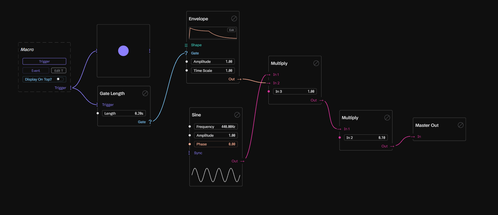
<!-- SCREENSHOT: Macro → Gate Length → Envelope → Multiply; Sine → Multiply → Multiply → Master Out -->

### Edit the envelope

> **BETA.** The Factory window (the Curve, Oscillator, Envelope and Wavetable
> editors) is new. It works, but not everything in it is polished yet, so expect
> rough edges.

Click **Edit** on the Envelope (or double-click its little curve). The **Factory**
window opens.

- **Presets ▾** has ADSR, Pluck, Swell and AR. Try them.
- **Drag** points to move them. **Drag the round handles** between points to bend
  the curve.
- **Double-click** to add a point. **Delete** removes the selected one.
- **Right-click** a point to change its segment (Curve, Smooth, Hold) or its marker.
  The **S** marker is where the envelope **holds** while the gate is on.
- **← Back** (or Esc) returns to the patch.

You hear every edit while you drag.

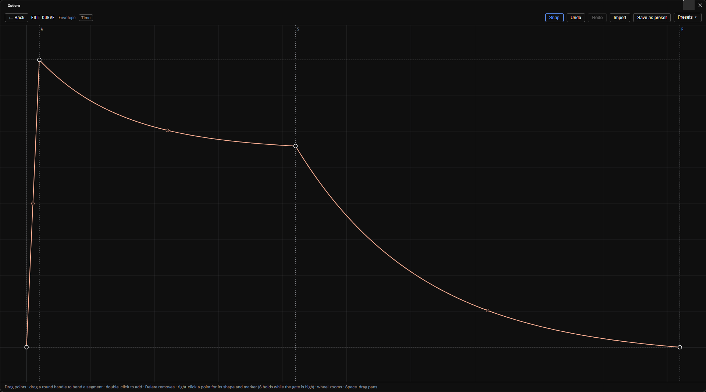
<!-- SCREENSHOT: the Factory window editing an ADSR, with the S marker visible -->

Try raising **Length** on Gate Length: the note holds longer at S.

---

## Level 4: Faster Hands

**Goal:** build faster with the keyboard.

You've used **M** already. Four letters spawn the most-used nodes straight onto
your mouse, ready to place or splice:

| Key | Node |
|---|---|
| **A** | Add |
| **S** or **M** | Multiply |
| **R** | Map |

More shortcuts that save a lot of clicking:

- **Ctrl+drag one node onto another** to add them together. A **+** follows your
  cursor. Let go over the second node and Bazalt places an **Add** with both of them
  wired in. Try it with two Sines at different frequencies.
- **Ctrl+D** duplicates the selection. The copy follows your mouse; click to drop
  it, or drop it on a cable to splice it.
- **Ctrl+C / Ctrl+X / Ctrl+V** copy, cut and paste.
- **Ctrl+A** selects everything. **Ctrl+R** renames the selected node.

---

## Level 5: Wobble

**Goal:** let one signal move another, and learn **Map**, the node that makes any
signal fit anywhere.

A Sine doesn't have to be a sound. Slowed down, it is a movement.

1. Add a second Sine and set its **Frequency** to `0.5` Hz. That's one wobble every
   two seconds.
2. Select it and press **Ctrl+Y**. A **Map** appears, wired to its output.
3. Wire the Map's output into the **Frequency** of your first Sine (the one you
   hear).
4. On the Map, set **Out Min** to `300` and **Out Max** to `600`.

The tone now glides up to 600 Hz and back. A siren.

Notice that it rests at 300 Hz for a while on every swing. A Sine goes from -1 to 1,
but the Map's input range (**In Min** to **In Max**) is 0 to 1, so everything below 0
is held at the bottom. Set **In Min** to `-1` and the glide becomes smooth all the
way.

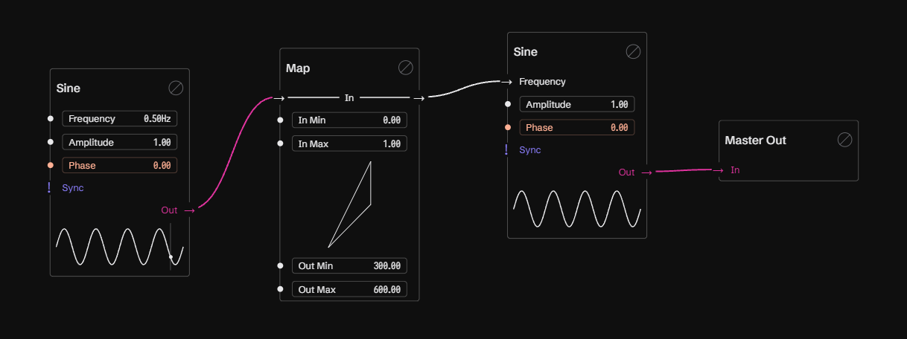
<!-- SCREENSHOT: slow Sine → Map (In 0..1, Out 300..600) → Frequency of the audible Sine -->

**Map** takes a range in (**In Min**, **In Max**) and turns it into a range out
(**Out Min**, **Out Max**). The diagram in the node shows exactly how. Whenever a
signal is in the wrong range for where you want it, put a Map in between. Press
**R** to spawn one and drop it on the cable.

Try:
- Map the slow Sine into the second Multiply's **In 2** for a tremolo (volume
  wobble).
- Ctrl+click the Map's output to watch the movement on a Scope.

---

## Level 6: Draw Your Own Sound

**Goal:** stop using ready-made waves and draw your own.

> **BETA.** The Factory window (the Curve, Oscillator, Envelope and Wavetable
> editors) is new. It works, but not everything in it is polished yet, so expect
> rough edges.

### Oscillator

The **Oscillator** plays any shape you draw.

1. Add an **Oscillator** and wire it in place of the Sine.
2. Click **Edit** on it. The Factory window opens in **Cycle** mode: what you see is
   one period of the wave.
3. Start from a preset (Sine, Triangle, Saw, Ramp, Square, Steps), then drag the
   points around.

Every shape plays without harsh digital aliasing, even at high pitches. Set the
Oscillator's **Frequency** to `2` Hz and the same node becomes a slow movement for
modulation, like the Sine in Level 5.

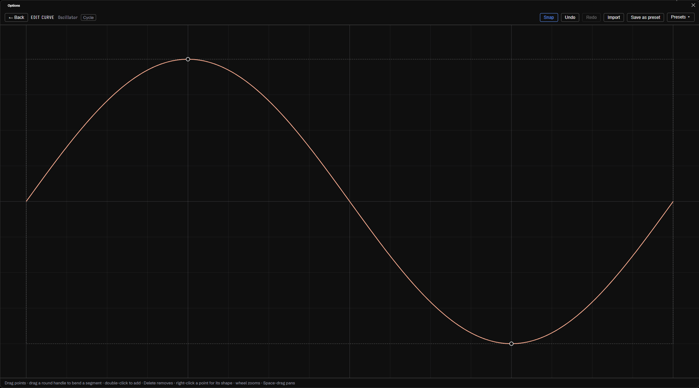
<!-- SCREENSHOT: the Factory window in Cycle mode -->

### Curve

A **Curve** node holds one drawn shape that several nodes can share. Wire its output
into the **Shape** input of any Oscillator or Envelope. A wired Shape plays the
cable instead of the node's own drawing.

### Wavetable

A **Wavetable** is a row of shapes (**keyframes**) that blend into each other.

1. Add a **Wavetable** and wire its **Table** output into an Oscillator's **Shape**.
2. Click **Edit**. Pick a preset, or add keyframes and draw each one.
3. Switch a keyframe to **Harmonics** to paint it as bars instead: one bar per
   overtone, the first bar is the fundamental.
4. Back in the patch, move the Wavetable's **Frame** slider. The sound sweeps through
   the table.
5. Plug a slow Sine (through a Map, to 0..1) into **Frame** for a moving timbre.

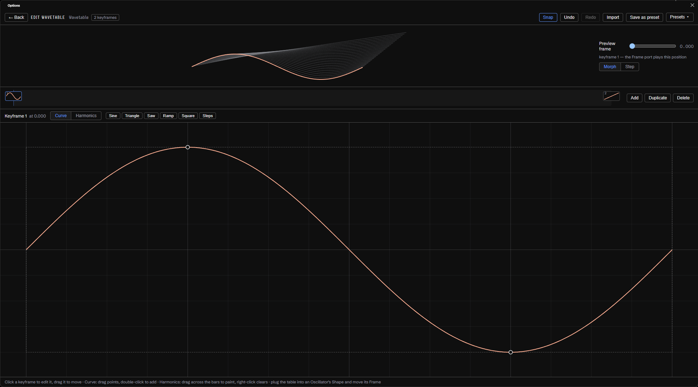
<!-- SCREENSHOT: the wavetable editor with the overview, the keyframe strip and the harmonics bars -->

---

## Level 7: Play It

**Goal:** play your synth from a MIDI keyboard.

> **UNDER CONSTRUCTION.** Playing from MIDI works, but not perfectly yet. Notes may
> not always end as cleanly as they should. This level will get smoother.

Make sure your keyboard is ticked under **Active MIDI inputs** (Level 0). Then build
this chain:

| From | To |
|---|---|
| **Note In** · Notes | **Voice** · Spawn |
| **Voice** · Pitch | **Pitch to Frequency** · Pitch |
| **Pitch to Frequency** · Frequency | **Sine** (or Oscillator) · Frequency |
| **Voice** · Gate | **Envelope** · Gate |
| **Sine** · Out | **Multiply** · In 1 |
| **Envelope** · Out | **Multiply** · In 2 |
| **Multiply** · Out | **Merge** · In |
| **Merge** · Out | **Master Out** · In |

Play a few notes at once.

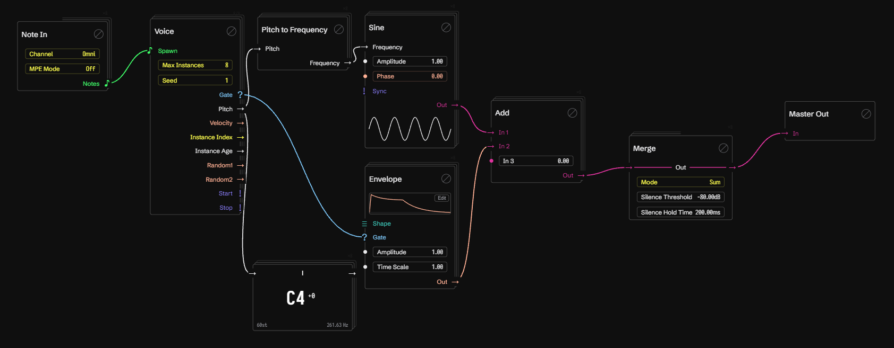

*In this screenshot the Sine and the Envelope meet in an **Add**. Use a
**Multiply**, as in the table: adding the Envelope only shifts the sound, so the note
never goes quiet.*
<!-- SCREENSHOT: the whole MIDI chain, with the stacked voice cards and the ×N badge visible -->

What's happening:

- **Note In** receives the notes from your keyboard.
- **Voice** gives every note its own copy of everything after it: its own Sine and
  its own Envelope. That's why those nodes now look like a **stack of cards** with a
  **×N** badge, where N is how many copies there are.
- **Pitch to Frequency** turns the note number into Hz.
- **Merge** adds all the copies back into one sound.

Ctrl+click **Pitch** on the Voice to see the played note on a **Tune** viewer.

### Knobs and faders

- To use a knob or fader on your controller, add a **MIDI Control** node and pick
  its **CC Number**. Its **Value** output (0..1) goes anywhere, through a Map if you
  need another range.
- In a DAW, automate the **Macro 1–32** parameters, or map your controller to them
  the way your DAW maps any plugin parameter.

---

## Level 8: Make It Pretty

**Goal:** a patch you can read a week later.

- **Reroute:** **Ctrl+click** a cable (or double-click it) to drop a small point on
  it. Drag the point to lead the cable around other nodes. Deleting a point keeps the
  connection.
- **Header, Comment and Box** are in the gallery under **Decorations**. Double-click
  the text to edit it. A Box is a coloured area behind a group of nodes: pick its
  colour when selected and drag its corner to resize.
- **Images:** drag an image file onto the canvas, or paste one (Ctrl+V). A photo of
  the instrument you're imitating, a diagram, a meme: images are fun, use them. All
  images in one patch share a 5 MB limit.
- **Rename** a node with Ctrl+R or by double-clicking its title.
- **Bypass** a node with the icon in its title bar, or by right-clicking it. A
  bypassed node lets its signal pass straight through, so you can hear the
  difference.

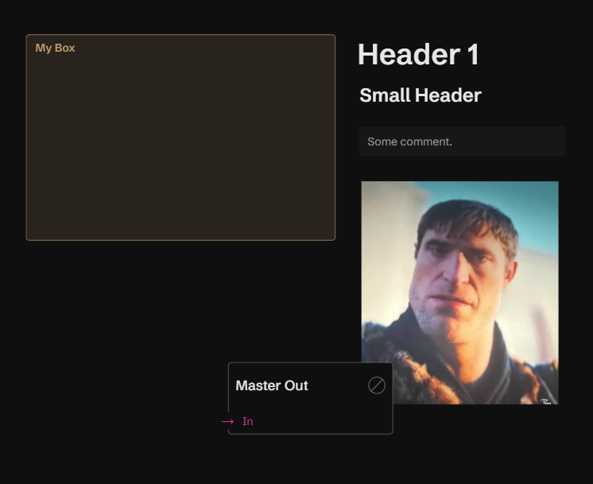
<!-- SCREENSHOT: a patch with a Header, a coloured Box around a group, a Comment, reroute points and an image -->

---

## Level 9: Keep It

**Goal:** save your work.

- The patch name in the middle of the top bar is the patch menu. It lists the
  factory patches and yours.
- **Ctrl+S** or the disk button saves. The first time, it asks for a name.
- **Save as…** in the patch menu saves a copy under a new name.
- Your patches are files in `%APPDATA%\Bazalt\Patches`.

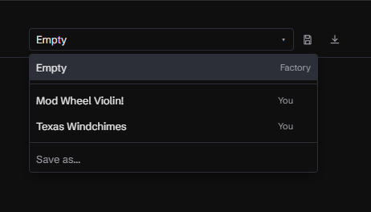
<!-- SCREENSHOT: the patch menu open with a few saved patches and Save as… -->

---

## Cheat sheet

| Action | Shortcut |
|---|---|
| Add a node | Shift+A, or right-click on empty space |
| Place / cancel a ghost | Click / Esc or right-click |
| Splice into a cable | Place a ghost over the cable and click |
| Add / Multiply / Map ghost | A / S or M / R |
| Map from the selected node | Ctrl+Y |
| Add two nodes together | Ctrl+drag one node onto the other |
| Macro for an input | Drag the unwired input out to empty space |
| Viewer for an output | Ctrl+click the output |
| Listen to one audio output | Ctrl+Alt+click it |
| Reroute point | Ctrl+click or double-click a cable |
| Remove a cable | Drag its input end away |
| Duplicate / copy / cut / paste | Ctrl+D / Ctrl+C / Ctrl+X / Ctrl+V |
| Select all / rename | Ctrl+A / Ctrl+R |
| Delete | Delete or Backspace |
| Undo / redo | Ctrl+Z / Ctrl+Shift+Z |
| Save | Ctrl+S |
| Zoom / pan | Wheel / right-drag or Space+drag |
| Slider: fine / type / reset | Shift+drag / click / double-click |

---

## Building from source

You need Windows x64, Visual Studio 2022, CMake and Node.js.

```
cd ui && npm ci && npm run build && cd ..
cmake -S . -B build -G "Visual Studio 17 2022" -A x64
cmake --build build --config Release
```

The Standalone app and the VST3 end up in `build/plugin/BazaltPlugin_artefacts/Release`,
each with the built UI copied next to it.

To run the tests:

```
cmake --build build --config Debug
ctest --test-dir build -C Debug --output-on-failure
```

The node catalog and the architecture are documented in `wiki/` (start with
`wiki/NODES.md` and `wiki/NODES.System.md`).
